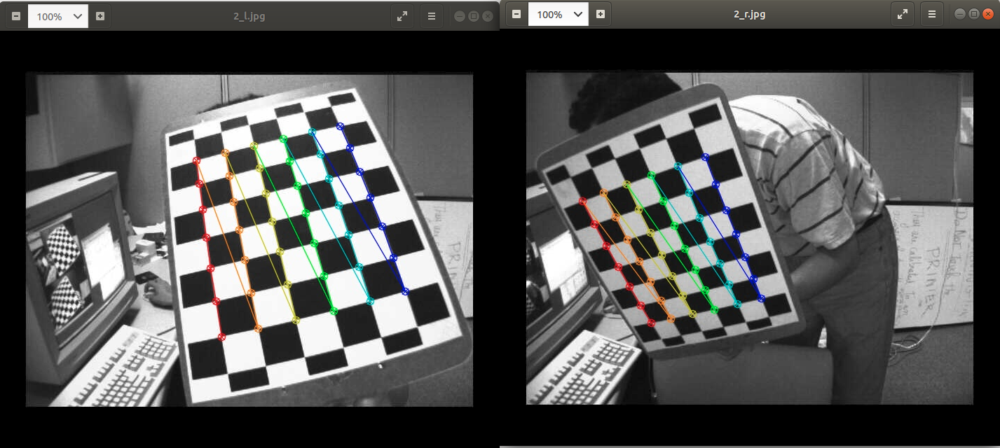

# 浙江大学软件学院2020年暑期夏令营AZFT分营Stereo项目报告

## 基本信息

- **姓名**: 唐郅杰 (1090489718@qq.com)
- **本科学校信息**：四川大学 软件学院 软件工程

- **选择导师**：蔡登

- **主要学习资料**：Opencv官方文档，Opencv官方论坛，Stackoverflow论坛，CSDN论坛，博客园，谷歌学术等等

- **运行环境配置**：
  - Ubuntu 18.04 LTS
  - Python 3.7
  - Opencv-python 4.3.0.36
  - PyCharm Professional 2019.3.4

- **报告编写环境**: Typora Markdown for Linux, ver 0.9.92

- **项目对应代码链接**：
  - Github: https://github.com/Asichurter/ZJU-summercamp-code
  - Git: git@github.com:Asichurter/ZJU-summercamp-code.git


## 报告主体

本报告内主要分为学习记录(Learning)，项目答题(Problem)和问题解决(solution)三部分。

- Learning主要包含的是为了解决问题而进行的学习的记录
- Problem是项目pdf（Project_stereo.pdf）中的问题的解决方案记录
- Solution是在完成项目过程中遇到的问题的解决过程记录


**目录：**

[TOC]


### Learning-照相机模型学习

主要参考资料: 维基百科：https://en.wikipedia.org/wiki/Camera_resectioning

**学习了照相机模型的主要内容**，包括：

- **齐次坐标**:

  对于3D坐标，齐次坐标的形式为:
  $$
  [X, Y, Z, 1]^T
  $$
  即在坐标最后添加了一个1。对于2D坐标，其齐次坐标形式为:
  $$
  [X,Y,1]^T
  $$

- **摄像机内部参数** intrinsic parameters: $K$，本身是一个3×4的矩阵，但是其中只有5个参数：
  $$
  K=\begin{bmatrix}
  \alpha_x&\gamma&u_0&0\\
  0&\alpha_y&v_0&0\\
  0&0&1&0\end{bmatrix}
  $$


  - $\alpha_x$和$\alpha_y$：焦距相关，其中$\alpha_x = f·m_x,\alpha_y = f·m_y$，$f$是以距离表示的焦距local length，$m_x,m_y$是距离到像素的比例因子
  - $u_0$和$v_0$是主要点principal point，通常位于图像中心
  - $\gamma$ 是x，y轴之间的倾斜因子，通常为0

- **摄像机外部参数** extrinsic parameters：$[R \ T]$
  $$
  \begin{bmatrix}
  R_{3\times3}&T_{3\times1}\\
  0_{1\times3}& 1\\
  \end{bmatrix}
  $$
  表示从3D的世界坐标系(world coordinate)向3D照相机坐标系(camera coordinate)的变换，主要定义了在世界坐标系中相机中心位置和相机朝向。

  $T$是以照相机为中心的坐标系统中，世界坐标系原点的位置，其不是相机的位置。相机的位置在世界坐标系中正确地应该是$C=-R^{-1}T=-R^{T}T$

  - $R$一把称为旋转矩阵，$T$一般称为位移向量

  - $R$，$T$和相机内部参数$K$共同组成相机投影矩阵，其可将相机照片中的点与3D世界坐标系中的点相关联
  - 常用于立体视觉stereo vision中，两个相机的相机投影矩阵用于计算两个相机中同时看到的点的3D世界坐标

- 四个坐标系：

  - 世界坐标系 world coordinate: 指实际的3D空间的坐标，坐标系原点可以任意指定

  - 相机坐标系 camera coordinate: 指以相机光心为原点，相机光轴为Z轴的3D坐标系。与世界坐标系的区别在于原点不同

  - 图像坐标系 image coordinate: 指成像平面上，以光轴与成像平面为原点，以mm为单位的2D坐标系

  - 像素坐标系 pixel coordinate: 指成像平面上，从Z轴正方向看去最左上点为原点，以pix为单位的2D坐标系。与图像坐标系的不同在于，像素有大小，且坐标值只能为整形

    


### Learning-相机成像原理Camera Imaging

主要参考资料: https://blog.csdn.net/baidu_38172402/article/details/81949447

**本节主要学习了照相机的成像原理，即内部，外部参数的几何意义**，包括：

- **世界坐标系到相机坐标系**：

  世界3D坐标系中$[X_W,Y_W,Z_W,1]^T$的一点要先转换到相机坐标系$[X_C,Y_C,Z_C,1]^T$中，主要设计刚体变换，需要进行旋转和平移两个操作，分别对应$R$矩阵和$t$向量

  - 绕z轴旋转的旋转矩阵$R_1$:
    $$
    R_1=\begin{bmatrix}
    cos\theta&-sin\theta&0\\
    sin\theta&cos\theta&0\\
    0&0&1
    \end{bmatrix}
    $$
    绕x轴旋转的旋转矩阵$R_2$:
    $$
    R_2=\begin{bmatrix}
    1&0&0\\
    0&cos\phi&sin\phi\\
    0&-sin\phi&cos\phi\\
    \end{bmatrix}
    $$
    绕y轴旋转的旋转矩阵$R_3$:

$$
R_3=\begin{bmatrix}
cos\omega&0&-sin\omega\\
0&1&0\\
sin\omega&0&cos\omega\\
\end{bmatrix}
$$

​			最终的旋转矩阵为:

​				$R = R_1 R_2 R_3$

  - 位移矩阵为$r \in R^{3\times 1}$

  - 最终的坐标转换形式为:
    $$
    \begin{bmatrix}
    X_c\\
    Y_c\\
    Z_c\\
    1
    \end{bmatrix}
    =
    \begin{bmatrix}
    R&T\\
    \overrightarrow{0}&1
    \end{bmatrix}
    \begin{bmatrix}
    X_W\\
    Y_W\\
    Z_W\\
    1
    \end{bmatrix}
    $$

- **相机坐标系到图像（像素）坐标系**:

  主要是利用了以相机光心为原点，3D点为远点的透视原理在成像平面上成像，参见下图（图源: https://blog.csdn.net/baidu_38172402/article/details/81949447）:

  

  主要利用的是相似三角形的原理。

  如果要将相机坐标系中的点转为像素坐标系，则需要给定x，y方向上的像素大小$m_x,m_y$，计算获得$f_x,f_y$（归一化焦距），然后利用以下公式：
  $$
  Z_c
  \begin{bmatrix}
  u\\v\\1
  \end{bmatrix}
  =
  \begin{bmatrix}
  f_x&0&u_0&0\\
  0&f_y&v_0&0\\
  0&0&1&0\\
  \end{bmatrix}
  \begin{bmatrix}
  R&T\\
  \overrightarrow{0}&1
  \end{bmatrix}
  \begin{bmatrix}
  X_W\\
  Y_W\\
  Z_W\\
  1
  \end{bmatrix}
  $$

  获得像素坐标$(u,v)$，其中$u_0,v_0$为图像中心点(点o在像素坐标系中的位置)


### Problem-1-相机矩阵，相机内外部参数

原问题主要询问相机内部参数，外部参数和相机矩阵的定义。

由[之前的学习](#Learning-照相机模型学习)可以知道：

- 摄像机内部参数是指将摄像机坐标系内的点映射到像素坐标系(或图像坐标系)的矩阵的中的参数,包括(归一化)焦距,中心点和倾斜因子等,表示为

$$
K=\begin{bmatrix}
\alpha_x&\gamma&u_0&0\\
0&\alpha_y&v_0&0\\
0&0&1&0\end{bmatrix}
$$

- 摄像机外部参数是指将世界坐标系映射到相机坐标系所需要的矩阵中的参数.该映射只涉及刚体变换,即旋转和平移,分别使用矩阵R和T表示,外部参数整体表示为

$$
\begin{bmatrix}
R&T\\
\overrightarrow{0}&1
\end{bmatrix}
=
\begin{bmatrix}
R&T
\end{bmatrix}
$$

- 相机矩阵是指相机内部参数组成的$3 \times 4$矩阵，即$K$


### Problem-2-3D点成像坐标

原问题主要询问在给定世界坐标内一点$X=(X_1,X_2,X_3)$时，其对应在成像平面上的坐标。

要解决本问题，需要按照[成像原理](#Learning-相机成像原理Camera Imaging)中的方法，先利用相机外部参数$(R|t)$将世界坐标转换为相机坐标，然后再利用相机内部参数$K$将相机坐标转换为图像坐标即可。

成像坐标$(u,v)$满足以下矩阵形式等式:
$$
\begin{bmatrix}
u\\v\\1
\end{bmatrix}
=
\frac{K[R|t]X}{s}
$$
其中：
$$
K=\begin{bmatrix}
f_x&0&c_x\\
0&f_y&c_y\\
0&0&1\\
\end{bmatrix}
(内部参数),
X=
\begin{bmatrix}
X_1\\
X_2\\
X_3\\
1\\
\end{bmatrix},
s = 
\begin{bmatrix}
r_{31}\\
r_{32}\\
r_{33}\\
t_3\\
\end{bmatrix}^T
\begin{bmatrix}
X_1\\
X_2\\
X_3\\
1\\
\end{bmatrix}(摄像机坐标系的Z坐标，归一化系数)
$$


由于在成像时，直接利用相机矩阵去处理相机坐标后，还需要除一个缩放因子才能得打实际的成像坐标。根据推导，该归一化因子就是$Z_C$（相机坐标系下的Z坐标）


### Problem-3-成像平面内的一点对应的相机坐标下的几何形状

由[上一个问题](#Problem-2-3D点成像坐标)可以知道，要从相机坐标系转换到图像坐标系，需要使用相机矩阵$K$。因此，考虑摄像机坐标系内任一点:
$$
P_c=\begin{bmatrix}
X_c\\
Y_c\\
Z_c\\
1\\
\end{bmatrix}
$$
和其对应的像素坐标系内点:
$$
P_p=\begin{bmatrix}
u\\
v\\
1\\
\end{bmatrix}
$$
两者存在关系:
$$
Z_c
\begin{bmatrix}
u\\v\\1
\end{bmatrix}
=
\begin{bmatrix}
f_x&0&u_0&0\\
0&f_y&v_0&0\\
0&0&1&0\\
\end{bmatrix}
\begin{bmatrix}
X_c\\
Y_c\\
Z_c\\
1\\
\end{bmatrix}
$$
由于给定$u,v$,需要求$X_c,Y_c,Z_c$的关系,因此展开矩阵乘法得到:
$$
\left\{  
             \begin{array}{**lr**}
             \frac{X_c}{Z_c}f_x+c_x=u\\
             \frac{Y_c}{Z_c}f_y+c_y=v\\
             \end{array}  
\right.
$$
整理得到:
$$
\left\{  
             \begin{array}{**lr**}
             \frac{X_c}{u-c_x}=\frac{Z_c}{f_x} \quad ①\\
             \frac{Y_c}{v-c_y}=\frac{Z_c}{f_y} \quad  ②\\
             \end{array}  
\right.
$$
显然,上式中①表示的是一个与摄像机坐标系Y轴平行且过光心的一个平面,②表示的是一个与摄像机坐标轴X轴平行且过光心的一个平面,两者同时成立说明其对应的是**一条摄像机坐标系内的直线,该直线恒过光心点且穿过成像平面的$(u,v)$点**


### Learning-相机标定Camera Calibration

主要参考了

- opencv的官方文档： https://docs.opencv.org/2.4/modules/calib3d/doc/camera_calibration_and_3d_reconstruction.html

- 张友定标定法论文:  Z. Zhang, “A flexible new technique for camera calibration,” IEEE Transactions on pattern analysis and machine intelligence, vol. 22, no. 11, pp. 1330–1334, 2000

- 部分博客:

  - https://blog.csdn.net/qq_40369926/article/details/89251296 （附有代码）

  - https://blog.csdn.net/wuwanneng/article/details/71125613
  - https://www.cnblogs.com/excellentlhw/p/10664460.html
  - SVD解齐次方程组：

    - https://blog.csdn.net/MyArrow/article/details/53780972


主要涉及以下内容：

- 相机标定camera calibration的意义：**通过一系列3D世界坐标系中的点这些点对应的图像坐标形成的”点对“，求解出camera的相机矩阵$K$和外部参数矩阵**$(R| t)$。由于相机矩阵不取决于相机拍摄的场景，因此一旦估计完成，只要焦距不变就可以一直使用；而对于外部参数，对于不同的场景view（每张照片可以看做不同的场景）

- 外部参数用于描述摄影机相对于点的运动或者点相对于固定的摄影机的运动,表示为$[R|t]$,其将点转化到摄影机坐标系中

- 镜头lens通常带有畸变（distortion），导致最终生成的图像和理论图像并不完全一致。畸变主要分为：

  - 径向畸变radial，主要是由于镜头表面部分在径向曲率的变化存在缺陷造成的
  - 切向畸变trangential，主要是由于镜头与成像平面不完全平行造成的.相机畸变会导致物体实际成像位置与理论成像位置出现偏差,且使得实际成像中的直线变得弯曲等等

  畸变系数与实际成像的关系可以使用以下式子计算（图源：https://docs.opencv.org/2.4/modules/calib3d/doc/camera_calibration_and_3d_reconstruction.html）

  

  - 畸变系数也不随场景变化，因此常常被视为内部参数的一部分，一旦估计就可以一直使用，且与图像分辨率无关

- 相机标定的一种常用方法是张友定标定法,其主要思想如下：

  1. **求解同质矩阵$H$**

     观察成像公式:
     $$
     s\begin{bmatrix}
     u\\
     v\\
     1\\
     \end{bmatrix}
     =
     K\begin{bmatrix}
     r_1&r_2&r_3&t\\
     \end{bmatrix}
     \begin{bmatrix}
     X\\
     Y\\
     0\\
     1\\
     \end{bmatrix}
     =
     K\begin{bmatrix}
     r_1&r_2&t\\
     \end{bmatrix}
     \begin{bmatrix}
     X\\
     Y\\
     1\\
     \end{bmatrix}
     $$
     可以考虑先通过点对联合解出相机矩阵和旋转-位移矩阵的乘积矩阵，再分开求解两者。

     令$\lambda K[r_1\ r_2 \ t]=H$,$H$称为同质矩阵(homogeneous matrix)，式子变为以下形式:
     $$
     s\begin{bmatrix}u\\v\\1\\\end{bmatrix}=H\begin{bmatrix}X\\Y\\1\\\end{bmatrix}
     $$
     H本身是一个$3\times 3$矩阵，由于是一个齐次矩阵，因此实际上只有8个未知数

     由上式关系可知:
     $$
     \left\{               
     \begin{array}{**lr**}			
     h_{11}X+h_{12}Y+h_{13}=u\\            
     h_{21}X+h_{22}Y+h_{23} =v\\            
     h_{31}X+h_{32}Y+h_{33} =1\\             
     \end{array}  
     \right.
     $$
     上述方程可以转化为2个齐次方程：
     $$
     \left\{               \begin{array}{**lr**}			h_{11}X+h_{12}Y+h_{13}-uh_{31}X-uh_{32}Y-uh_{33}=0\\            h_{21}X+h_{22}Y+h_{23}-vh_{31}X-vh_{32}Y-vh_{33} =0\\             \end{array}  \right.\rightarrow\begin{bmatrix}h_{11}\\h_{12}\\h_{13}\\h_{21}\\h_{22}\\h_{23}\\h_{31}\\h_{32}\\h_{33}\\\end{bmatrix}^T\begin{bmatrix}X&Y&1&0&0&0&-uX&-uY&-u\\0&0&0&X&Y&1&-vX&-vY&-v\\\end{bmatrix}=\begin{bmatrix}0\\0\\\end{bmatrix}
     $$
     如果有$n$个3D-2D点对，那就有$2n$个类似的方程，可以将其他方程的参数堆叠起来，右侧变为$2n$个0的齐次方程。利用SVD解该齐次方程，SVD的获得的$V$中特征值最小的向量作为解$H$，整形为$3\times 3$矩阵即可解出$H$。

     **由于$H$中存在8个未知数，因此至少需要4对点对才能解出一个同质矩阵$H$**

     

  2. **利用同质矩阵$H$求解内部矩阵$K$**

     观察h的定义式$\lambda K[r_1\ r_2 \ t]=H$且已知旋转向量之间必定相互垂直且模长为1（旋转不改变模长），即：
     $$
     \left\{               
     \begin{array}{**lr**}	
     r_1^Tr_2=0\\
     ||r_1||=||r_2||=1\\
     \end{array}  
     \right.
     $$
     可得:
     $$
     \left\{               
     \begin{array}{**lr**}
     h_1^TK^{-T}K^{-1}h_2=0\\
     h_1^TK^{-T}K^{-1}h_1=h_2^TK^{-T}K^{-1}h_2\\
     \end{array}  
     \right.
     $$
     显然，一个同质矩阵$H$矩阵可以获得2个以上方程。**由于K内部矩阵有5个未知数，因此至少需要3个不同的view才能解出内部参数**$K$

     

  3. **求解外部参数$(R|t)$**

     解出$H=K (R|t)$和$H$后，可以直接解出外参数矩阵。至此，相机矩阵和外部参数全部求解完成，标定结束
     
     
  


### Problem-4-相机畸变 Distortion

原问题是给定畸变后成像平面内一点，相机矩阵和畸变系数，能否求解发生畸变前的点的坐标

由[之前的学习](#Learning-相机标定Camera Calibration)可以知道，相机的畸变分为径向畸变radial和切向畸变trangential两种,前者是由于镜头表面部分在径向曲率的变化存在缺陷造成的,后者主要是由于镜头与成像平面不完全平行造成的.相机畸变会导致物体实际成像位置与理论成像位置出现偏差,且使得实际成像中的直线变得弯曲等等.

按照opencv官网上的教程,给定畸变后的图像任一点$(u,v)$和畸变系数$k_1,k_2,p_1,p_2$,可以通过联立方程解出畸变前相机坐标系中的点$x',y'$:
$$
\left\{  
             \begin{array}{**lr**}
             x'' = x'(1+k_1 r^2+k_2 r^4)+2p_1 x'y'+p_2(r^2+2x'^2)=\frac{(u-c_x)} {f_x} \quad ①\\
             y'' = y'(1+k_1 r^2+k_2 r^4)+2p_2 x'y'+p_1(r^2+2y'^2)=\frac{(v-c_y)} {f_y} \quad  ②\\
             r^2 = x'^2 + y'^2 \quad ③
             \end{array}  
\right.
$$
该方程是一个二元的高次方程,难以直接求解,可以考虑以下方法求解:

- 数值方法
- 使用Brown-Conrady模型的方法: [https://en.wikipedia.org/wiki/Distortion_%28optics%29](https://en.wikipedia.org/wiki/Distortion_(optics))

实际中,可以考虑以下方法进行畸变校正:

- **考虑畸变校正后的图像的任意一点$(u,v)$,可以使用内部参数获取到畸变前的摄像机坐标$(x',y')$,然后正向推导计算该点如果发生畸变则会对应到的像素坐标系中的点$(u',v')$,将畸变图像中的$(u',v')$的像素值复制给校正后图像的$(u,v)$位置即可(因为两者映射实际为单射)**,方法来自https://blog.csdn.net/humanking7/article/details/45037239


### Problem-5-相机标定 Camera Calibration

原问题主要是描述什么是相机标定。

相机标定camera calibration 主要是为了测定相机的内部参数矩阵$K$,如焦距,中心点坐标$(c_x,c_y)$和畸变系数($k_1,k_2,k_3,p_1,p_2等$),还有相机外部参数$(R|t)$.如旋转矩阵和位移向量.

相机标定的主要目的是**利用标定过程中获取的内部和外部参数进行畸变校正和求取3D场景的模型以便利用2D图像对3D场景进行重建**.相机标定的过程实际就是给定若干个(3D坐标-2D坐标) 值对,利用小孔相机数学模型求解出外部和内部参数的过程

该过程常常利用棋盘图的角点坐标进行,标定过程可以使用多组点并利用最小二乘法来实现,参考:https://www.cnblogs.com/narjaja/p/9486407.html


### Problem-6-编程实现标定 Calibration Programming

参考资料:

- opencv官方文档: https://opencv-python-tutroals.readthedocs.io/en/latest/py_tutorials/py_calib3d/py_calibration/py_calibration.html?highlight=calibration
- 部分CSDN博客：https://blog.csdn.net/weixin_43843780/article/details/89294131


由[之前的学习](#Learning-相机标定Camera Calibration)可以知道，要标定一台摄像机，不仅需要从多个场景或者角度进行拍摄（至少3个场景），还需要同一个场景获取多个3D-2D对应的点对（至少4对）。为了方便进行标定，一般使用棋盘图进行标定，因为棋盘图有三个好处：

- 通过将世界坐标系建立咋棋盘图上，可以很轻松的观察出点的世界3D坐标
- 棋盘图本身位于2D平面上，可以令世界坐标系中的点的$Z$坐标为0
- 棋盘图特征点明显，容易找出特征点的2D坐标（$k$行$j$列的棋盘点的世界坐标为$(k,j,0)$），判断点对是否一一对应


主要调用的Opencv接口包括:

- **findChessBoardCorners**: 寻找棋盘图的角点
- **cornerSubPix**: 获取更精确的棋盘图角点亚像素
- **calibrateCamera**: 相机标定，获取标定后的相机矩阵，外部参数和畸变系数

**代码位于scripts/calibration_undistort.py中**，可以在项目根目录下，使用以下命令执行:

```powershell
python scripts/calibration_undistort.py
```

代码会自动读取imgs/left中的jpg文件进行标定

整个代码逻辑可以使用下图表示:

```flow
st=>start: 开始
imread=>operation: 读取图像
corners=>operation: 寻找棋盘图角点
obj=>operation: 添加世界坐标对应点
calibration=>operation: 相机标定
params=>operation: 获取相机矩阵，外部参数和畸变系数
count=>condition: 图像是否读取完
e=>end: 结束
st->imread->corners->obj->count
count(yes)->calibration->params->e
count(no)->imread
```

标定结果展示:


### Problem-7-编程实现畸变校正 Undistort Programming

参考资料：

opencv官方文档: https://opencv-python-tutroals.readthedocs.io/en/latest/py_tutorials/py_calib3d/py_calibration/py_calibration.html?highlight=calibration


**主要利用了[Problem-6](#Problem-6-编程实现标定 Calibration Programming)之中求得的畸变系数和相机矩阵对图像进行畸变校正**，使用的opencv的接口包括：

- **undistort**：利用畸变系数对图像进行畸变校正，其需要输入畸变图像和相机标定求得的相机矩阵
- **getOptimalNewCameraMatrix**: 进一步精化求得的相机矩阵，同时获取畸变校正后图像的有效范围，方便进行裁剪


代码位于**scripts/calibration_undistort.py**，可以在项目根目录下，使用以下命令执行:

```powershell
python scripts/calibration_undistort.py
```

代码会自动读取imgs/left的某个图像进行畸变校正，将效果图保存到imgs/imgs/undistort中。

效果如下：

**校正前:**


**校正后**


**校正后不使用裁剪:**


校正后的图像中的棋盘不再是曲线，而是显示为直线。由上图可得知，显然图像发生了枕型畸变


### Problem-8.5-能否使用单目摄像机估计深度

**仅仅使用一个camera是无法测定照片像素的实际深度的**。

根据[Promblem-3](#Problem-3-成像平面内的一点对应的相机坐标下的几何形状)，**照片上的一个点实际对应的是3D世界坐标中的一条空间直线无法直接映射到一个点上**。如果要预测深度，可以考虑多使用一台camera进行测定（双目摄像机）。此时，根据两个camera对同一个3D世界坐标系中的一个点进行测定，可以生成两条空间直线，**而两条空间直线的交点就是3D世界坐标系中点的位置**


### Problem-9-3D世界坐标投影到双目摄像机中 Projection

由于世界坐标系与左camera的相机坐标系对齐了，**因此左camera的相机坐标与世界坐标相同，无需外部参数**，因此左camera的投影点为:

$$
(f_x\frac{X_1}{X_3}+c_x, f_y\frac{X_2}{X_3}+c_y)
$$
右camera的投影点为：
$$
(f_x'\frac{X_1'}{X_3'}+c_x', f_y'\frac{X_2'}{X_3'}+c_y')
$$
其中$[X_1',X_2',X_3',1]^T$是点$[X_1,X_2,X_3,1]^T$（齐次坐标形式）经过$(R|t)$刚体变换后的结果，满足：


$$
\begin{bmatrix}
X_1'\\
X_2'\\
X_3'\\
1\\
\end{bmatrix}
=
[R|t]
\begin{bmatrix}
X_1\\
X_2\\
X_3\\
1\\
\end{bmatrix}
$$


### Problem-10-极线方程 Epipolar Line

主要参考了博客: https://www.cnblogs.com/wangguchangqing/p/8151128.html

由[Problem-3](#Problem-3-成像平面内的一点对应的相机坐标下的几何形状)可知，在左camera平面内的点$(u,v)$与相机空间内的一条空间直线相对应，该直线的方程为:
$$
\left\{  
             \begin{array}{**lr**}
             \frac{X_l}{u-c_x}=\frac{Z_l}{f_x} \quad \\
             \frac{Y_l}{v-c_y}=\frac{Z_l}{f_y} \quad  \\
             \end{array}  
\right.
=>
\left\{  
             \begin{array}{**lr**}
             X_l = \frac{Z_l(u-c_x)}{f_x} \quad ①\\
             Y_l = \frac{Z_l(v-c_y)}{f_y} \quad ②\\
             \end{array}  
\right.
$$
令右camera内的点为$\begin{bmatrix}X_r\\Y_r\\Z_r\\\end{bmatrix}$,则由相机外部参数$(R|t)$可得两者关系为:
$$
\begin{bmatrix}
X_r\\
Y_r\\
Z_r\\
\end{bmatrix}
=
R
\begin{bmatrix}
X_l\\
Y_l\\
Z_l\\
\end{bmatrix}
+t
=
Z_l R
\begin{bmatrix}
X_l/Z_l\\
Y_l/Z_l\\
1\\
\end{bmatrix}
+t
$$
令$R=\begin{bmatrix}R_1\\R_2\\R_3\\\end{bmatrix}t=\begin{bmatrix}t_1\\t_2\\t_3\\\end{bmatrix}$，按照三个坐标分别拆开可得:
$$
\left\{  
             \begin{array}{**lr**}
             X_r = Z_l R_1\begin{bmatrix}X_l/Z_l\\Y_l/Z_l\\1\\\end{bmatrix} + t_1\quad \\
  			Y_r = Z_l R_2\begin{bmatrix}X_l/Z_l\\Y_l/Z_l\\1\\\end{bmatrix} + t_2\quad \\
            Z_r = Z_l R_3\begin{bmatrix}X_l/Z_l\\Y_l/Z_l\\1\\\end{bmatrix} + t_3\quad \\
             \end{array}  
\right.
$$
令$R_1\begin{bmatrix}X_l/Z_l\\Y_l/Z_l\\1\\\end{bmatrix}=X_1,R_2\begin{bmatrix}X_l/Z_l\\Y_l/Z_l\\1\\\end{bmatrix}=X_2,R_3\begin{bmatrix}X_l/Z_l\\Y_l/Z_l\\1\\\end{bmatrix}=X_3$, 则可以得到右camera坐标系内的归一化坐标:
$$
\left\{  
             \begin{array}{**lr**}
             X_r' = \frac{X_r}{Z_r} = \frac{Z_l X_1+t_1}{Z_lX_3+t_3} \\
             Y_r' = \frac{Y_r}{Z_r} = \frac{Z_l X_2+t_2}{Z_lX_3+t_3} \\
             \end{array}  
\right.
$$
根据使用右camera内部参数将右camera坐标系内的点映射到右侧像素平面的公式，可得右侧像素平面的内对应点$(u',v')$满足:
$$
\left\{  
             \begin{array}{**lr**}
             u' =f_x' X_r' + c_x'= \frac{Z_l X_1+t_1}{Z_l X_3 + t_3}f_x'+c_x' \\
             v' =f_y' Y_r' + c_y'= \frac{Z_l X_2+t_2}{Z_l X_3 + t_3}f_y'+c_y'\\
             \end{array}  
\right.
$$
显然，上式是一个以$Z_l$为参数的参数方程，消去参数$Z_l$可得极线约束下，左侧相机平面内点$(u,v)$对应的极线方程 (以$(u',v')$表示):
$$
\frac{t_3 (u'-c_x')-t_1f_x'}{f_x'(t_1X_3-t_3X_1)}=\frac{t_3 (v'-c_y')-t_2f_y'}{f_y'(t_2 X_3 - t_3 X_2)}
$$
，其中$X_1,X_2和X_3$由①，②式可知满足以下等式：
$$
X=
\begin{bmatrix}
X_1\\
X_2\\
X_3\\
\end{bmatrix}
=
R
\begin{bmatrix}
(u-c_x)/f_x\\
(v-c_y)/f_y\\
1\\
\end{bmatrix}
$$


极线可以从图中很轻松的看出其形态，如下图所示，$e'x'$表示的就是右侧成像平面内的极线（来源: https://www.cnblogs.com/wangguchangqing/p/8151128.html）


显然左相机坐标原点，右相机坐标原点和3D世界坐标系内某点x构成了一个平面（称为极平面**Epipolar Plane**）,该平面与两个成像平面的交线就是两个平面的极线


### Problem-11-基础矩阵 Fundamental Matrix

主要参考了博客：

-  https://www.cnblogs.com/clarenceliang/p/6704970.html
- https://www.cnblogs.com/fuzhuoxin/p/12677986.html  (该博客内假设两个相机的内部参数相同，与本问题的设定并不完全一致，因此需要进行一定的修改)


令左相机的相机矩阵为$K_l$，右相机的相机矩阵为$K_r$，世界坐标系（左相机的相机坐标系）内任意一点为$x$,由左右相机之间的相机坐标系关系可知: 
$$
x_l=K_l x\\
x_r=K_r (Rx+t)
$$
经过变形有:
$$
x= K_l^{-1}  x_l \quad ①\\
K_r^{-1}x_r =Rx+t \quad ②\\
$$
将①式带入②式可得
$$
K_r^{-1} x_r  = R K_l^{-1} x_l +t
$$
为了消去右侧单独一个$t$项，两侧同时叉乘$t$, 等式变为:
$$
t \times K_r^{-1}x_r = t \times R K_l^{-1} x_l
$$
再在两侧同时点乘一个$K_r^{-1} x_r$，等式左侧因为两个相互垂直的向量点乘而变为0：
$$
x_r^TK_r^{-T}(t \times K_r^{-1} x_r ) =  x_r^T K_r^{-T} t \times R K_l^{-1} x_l = 0
$$
令$F^T = K_r^{-T} t \times R K_l^{-1} $，则在等式两边同时取转置得:
$$
(x_r^T F^T x_l)T = 0 \rightarrow x_l^T F x_r = 0
$$
该式子与基础矩阵的形式相同，因此可得基础矩阵 $F = (K_r^{-T}t \times R K_l^{-1})^T=K_l^{-T} t \times R K_r^{-1}$

该式子同时说明，对于左成像平面上任意一点$x_l$，总是存在一条直线$l=x_lF$与之对应，使得让右平面内的点$p_r$满足$lx_r=0$,即$p_r \in l$，即右成像平面内存在一条对应的直线。这相当于证实了[Problem-10](#Problem-10-极线方程 Epipolar Line)中证明的极线的存在性

显然，基础矩阵$F$描述的是两个摄像机的图像坐标系内的点的关系。**使用基础矩阵可以在已知一个摄像机内图像坐标中一点$(u,v)$时，求出其在另一个摄像机的图像坐标系内的对应点$(u',v')$**。求解基础矩阵不仅需要两台摄像机之间的位置和角度关系（由$(R|t)$描述），还需要分别知道两台摄像机的相机矩阵$K_1,K_2$


### Learing-双目摄像机标定 Stereo Calibration

主要参考了博客：https://blog.csdn.net/xuelabizp/article/details/50417914

双目摄像机标定不同于单目，**不仅要求出每个摄像机的相机矩阵，还需要求出两台摄像机之间的旋转和位移矩阵$(R|t)$**。具体地，需要标定的参数包括：

- 两台摄像机的内部参数，包括相机矩阵和畸变系数
- 本质矩阵$E$
- 基础矩阵$F$
- 旋转矩阵$R$和平移矩阵$t$

两台摄像机的内部参数可以通过分别标定获得，**而两台摄像机之间的旋转和位移矩阵需要使用两台摄像机在分别标定时获得的$(R|t)$来计算获得**。具体地，以左摄像机为世界坐标原点来方便计算，那么右摄像机与左摄像机坐标系之间的关系为:
$$
P_r = RP_l+t
$$
左右摄像机在单独标定时，求得的外部参数标定的摄像机坐标系关系为:
$$
\left\{  
             \begin{array}{**lr**}
             P_r = R_r P+t_r\\
              P_l = R_l P+t_l\\
             \end{array}  
\right.
$$
联立两者可以得到：
$$
P_r = R(R_l P+t_l)+t_r=R_r P + t_r
$$
展开，将P和t的系数对应可以得到:
$$
\left\{  
             \begin{array}{**lr**}
             R_r = R R_l\\
              t_r = R t_l +t\\
             \end{array}  
\right.
\rightarrow
\left\{  
             \begin{array}{**lr**}
             R = R_rR_l^T\\
             t=t_r - R t_l\\
             \end{array}  
\right.
$$
因此，可以单独标定两个camera，然后利用上述式子求出以左摄像机坐标系为世界坐标系到右摄像机坐标系的旋转矩阵$R$和位移矩阵$t$。

可以使用在[Problem-11](#Problem-11-基础矩阵 Fundamental Matrix)中推导得到的公式，利用求出的$(R|t)$计算本征矩阵$E$和基础矩阵$F$：
$$
F = (K_r^{-T}t \times R K_l^{-1})^T=K_l^{-T} t \times R K_r^{-1}
$$
其中$K_l$和$K_r$是左右两摄像机的内部参数，由单独标定得到。同理，本征矩阵可以在双目摄像机标定得到$(R|t)$后计算得到，如下：
$$
E =t \times R
$$


### Problem-12-双目摄像机标定编程 Stereo Calibration Programming

主要参考了Opencv官方文档: 

https://docs.opencv.org/2.4/modules/calib3d/doc/camera_calibration_and_3d_reconstruction.html#stereocalibrate


双目标定对应的代码位于 scripts/stereo_calibration.py 中，可以在项目根目录下，使用以下命令执行:

```powershell
python scripts/stereo_calibration.py
```

将会使用imgs/left和imgs/right中的jpg文件进行双目标定，主要使用了以下opencv的API:

- **findChessBoardCorners**: 寻找棋盘图的角点
- **cornerSubPix**: 获取更精确的棋盘图角点亚像素
- **calibrateCamera**: 单目相机标定，获取标定后的相机矩阵，外部参数和畸变系数
- **stereoCalibrate**： 双目相机标定，需要输入两台摄像机的相机矩阵，畸变系数和对应点

整个代码逻辑可以使用下图表示:

```flow
st=>start: 开始
imread=>operation: 读取左，右图像
corners=>operation: 分别寻找左右棋盘图角点
cornercond=>condition: 是否左右图同时发现角点
obj=>operation: 添加世界坐标对应点
calibration=>operation: 相机标定
stereocalib=>operation: 双目相机标定
count=>condition: 图像是否读取完
e=>end: 结束
st->imread->corners->cornercond
cornercond(yes)->obj->count
cornercond(no)->imread
count(yes)->calibration->stereocalib->e
count(no)->imread
```


### Solution-双目标定编程中遇到的问题解决记录

- 问题描述：使用opencv的接口stereoCalibration时，**ret（即RMS）过大**，超过了50，说明双目摄像机的标定结果非常不理想，如果不进行纠正，则有可能影响到后续的retification

- 问题参考：

  - https://stackoverflow.com/questions/23826541/opencv-stereocalibrate-returns-high-rms-error
  - https://answers.opencv.org/question/177282/stereo-calibration-large-reprojection-error/

- 问题探索：

  1. 查阅资料，发现网络上提出的RMS特别大主要分为一下几个情况:（主要）

     - 单目摄像机标定结果不理想，导致计算出的相机矩阵有较大的误差

     - 左右图像在标定时棋盘点没有对应

       

  2. 通过查看cameraCalibration的结果来验证第一个可能问题，结果如下:

     

     结果显示，两个camera单独标定时，其标定精度非常高，达到了接近0.15的优秀水平，**这说明问题不是来自相机的单独标定，而是来自于双目标定stereoCalibration**。

     

  3. 继续验证是否是第二个问题，在调用cv2.findChessBoardCorners寻找棋盘角点时，将角点打印出来查看左右两幅图的角点是否在3D坐标系下是相互对应的，结果显示如下：

     

     由图中可以看到，棋盘点是一一对应的，因此排除了第二个可能的问题。但是，经过仔细观察，发现左右两张图的原图似乎并不对应（并非出于同一场景的左右摄像机图像）

     

  4. 考虑检查是否出现了左右两图不对应的情况，结果如下：

     

     其结果印证了我的猜想，果然是因为左右图像在标定时没有一致对应导致的问题。进一步探索原因，发现在代码中使用了glob模块进行图像路径的获取，但是该模块并不是按照文件名进行排序的，而是无序的。因此这才是导致左右图像不一致的根本原因

     

  5. 为了使得左右图像文件路径对应，使用sorted函数对左右图像的文件名进行排序即可：

     

     最终结果如下：

     

     虽然RMS下降了大约10，但是还是维持在40左右的较高水平下，说明双目标定结果仍然十分不理想，还存在其他潜在原因导致较大的RMS

     

  6. 继续查阅资料，发现有人在论坛上提出，某些左右图像pair会因为差距较大导致较大的RMS，使得标定结果较差，可以考虑手动发现并移除这些pair

     

  7. 手动过滤部分头像对，查看是否单独存在图像对显著增大了RMS，经过筛查发现,left14.jpg和right14.jpg 这一图像对是增大RMS的幕后原因，可以将这两者视为噪声，将其移除。移除后结果:

     

     可以看到，移除了噪声后，双目标定结果的RMS接近0.15，表示标定结果较好，证明想法正确，问题解决

     

- 问题总结：
  - 问题主要是由左右图像不对应和较大噪声的左右图像对造成
  - 问题解决方案：
    - 使用sorted对图像名称排序使得左右图像匹配
    - 双目标定时，排除left14.jpg和right14.jpg噪声图像对


### Problem-13-任选极线上点求3D世界坐标

原问题主要是问，已知在左摄像机图像坐标系内一点$(u,v)$会对应到右摄像机图像坐标系内的一条直线（极线），如果任选极线上一点，能否求出3D世界坐标。

根据[Problem-11-基础矩阵](#Problem-11-基础矩阵 Fundamental Matrix)中的结论，对于任意左成像平面一点$p_l$，对于右成像平面内的点$p_r$，其两者与基础矩阵$F$存在以下关系:
$$
p_l^T F p_r = 0
$$
显然，对于直线$l=F^Tp_l$，右成像平面内存在一系列点$x_r$满足$l^Tp_r=0$，即$p_r$位于直线$l$上，因此极线方程就是$l=F^T p_l$

如果选择右成像平面中的极线上一点$p_r$，且已知左成像平面上对应点$p_l$，要求3D世界坐标系中对应点的坐标，可以考虑将左右成像平面上的点分别使用各自的相机矩阵投影回各自的相机坐标系中。由[Problem-3](#Problem-3-成像平面内的一点对应的相机坐标下的几何形状)可知，将会生成两条分别位于左右相机坐标系中的两条直线$l_1,l_2$，而3D世界坐标系的对应点一定同时位于这两条直线上。**使用旋转矩阵和位移向量$(R|t)$将两条直线投影回世界坐标系中后，求两条直线的交点即为3D世界坐标系中的坐标**


### Learning-双目摄像机整型 Stereo Rectification

主要参考博客:  http://blog.csdn.net/gdut2015go/article/details/48391949

一般情况下，双目摄像机之间的角度和距离存在任意性，导致两台摄像机之间由于存在一个较为复杂的$(R|t)$变换，使得两台摄像机之间对应点的变换非常复杂，不易于双目系统处理

因此可以使用整型技术rectification使得两台摄像机的**光轴平行且同向，同时让两台摄像机的在世界坐标系下只有X坐标不同**。这样一来，**两者的对应点的两条基线会呈现平行的状态，而且两条极线的在图像中的位置相同**。可以使用以上标准来判断是否整型成功


### Problem-14-双目摄像机整型编程 Stereo Rectification Programming

主要参考:

- opencv官方文档: https://docs.opencv.org/2.4/modules/calib3d/doc/camera_calibration_and_3d_reconstruction.html#cv.StereoRectify
- 其他网站上的开源代码 : http://codingdict.com/sources/py/cv2/4641.html 

使用的opencv的API包括：

- **findChessBoardCorners**: 寻找棋盘图的角点
- **cornerSubPix**: 获取更精确的棋盘图角点亚像素
- **calibrateCamera**: 单目相机标定，获取标定后的相机矩阵，外部参数和畸变系数
- **stereoCalibrate**： 双目相机标定，需要输入两台摄像机的相机矩阵，畸变系数和对应点
- **stereoRectify**: 双目相机整型，利用获取到的相机矩阵，畸变系数，旋转矩阵和位移向量，和映射矩阵project matrix $P_1,P_2$，将3D世界坐标内的点直接投影到对齐后的相机坐标系中
- **initUndistortRectifyMap**：利用整型后获得的两台摄像机各自的旋转矩阵和位移向量，相机矩阵和畸变系数，计算整型后图形的映射
- **remap**: 利用计算得到的整形后图像映射重新映射图像

**双目整型对应的代码位于 scripts/rectification.py 中**，可以在项目根目录下，使用以下命令执行:

```powershell
python scripts/rectification.py
```

将会使用imgs/left和imgs/right中的jpg文件进行整型映射的计算，然后将原图片进行整型映射，整型后的图像位于 imgs/rectified/left 和 imgs/rectified/left中。

代码基本逻辑如下：

```flow
st=>start: 开始
imread=>operation: 读取左，右图像
corners=>operation: 分别寻找左右棋盘图角点
cornercond=>condition: 是否左右图同时发现角点
obj=>operation: 添加世界坐标对应点
calibration=>operation: 相机标定
stereocalib=>operation: 双目相机标定
rectify=>operation: 双目相机整型
calmap=>operation: 计算整型后的图像映射
remap=>operation: 利用计算得到的整型映射重映射图像
count=>condition: 图像是否读取完
e=>end: 结束
st->imread->corners->cornercond
cornercond(yes)->obj->count
cornercond(no)->imread
count(yes)->calibration->stereocalib->rectify->calmap->remap->e
count(no)->imread
```

效果图:

整形前：


整形后；


可以看出，右摄像机的角度明显发生了偏转，因为整形前右摄像机图像的背景的白板明显是倾斜的，但是整形后，白板变得与成像界面呈平行的姿态；左图中右边部分的收手也因为整形后的角度偏转遮挡了一部分。使用肉眼可以验证，整形后摄像机基本平行。通过绘制极线的方式证明已经整形成功


### Solution-极线绘制中遇到的问题解决

- 问题描述：

  按照[双目整型中的知识](#Learning-双目摄像机整型 Rectification)，在整型后，对应图像的对应点的极线不仅应该相互平行，而且应该处于相同位置，使得两张图像平行排列时可以对接。但是，在原实现中，将极线绘制在 stereo_rectification.py 中，直接利用了整形前计算得到的基础矩阵$F$，这导致了一下极线不对应的错误情况发生:

  

- 问题参考:
  - 极线绘制的官方文档:https://docs.opencv.org/2.4/modules/calib3d/doc/camera_calibration_and_3d_reconstruction.html?highlight=epilines#cv.ComputeCorrespondEpilines

- 问题探索:

  1. 首先官方文档资料，查看计算极线的主要API, **computeCorrespondEpilines** 的主要参数的意义。发现：其原理是利用给定的基础矩阵，直接在两张图中进行点的转换，因为基础矩阵本身就是描述两个像素坐标系内点的关系的。因此，极**线本身依赖于这个输入的基础矩阵**

  2. 通过思考发现，**如果直接使用在双目标定时计算得到的基础矩阵$F$，则会在计算整型后图像的极线时，沿用整型前的基础矩阵数据，这是一个潜在的错误原因**

  3. 尝试将极线绘制的代码从 rectification.py中迁移到**draw_epipolar_line.py**中，使用整型后的图片(位于 imgs/rectified/left 和 imgs/rectified/right 中) 重新进行标定，并使用整型后图像的基础矩阵$F'$来绘制极线

  4. 最终效果显示，极线已经相互对齐，问题解决

     

- 问题总结:
  - 使用整型后的图像的基础矩阵计算极线
  - 绘制极线的代码位于 scripts/draw_epipolar_line.py中，在项目根目录下使用以下指令执行，最终的极线的图像位于 imgs/rectified/line_left.jpg 和 imgs/rectified/line_right.jpg


### Problem-15-计算baseline

主要参考  https://www.it1352.com/1607473.html 来获取投影矩阵的定义

在[调用rectify的API](#Problem-14-双目摄像机整型编程 Rectification Programming)时，会获得左右摄像机的投影矩阵$P1,P_2$。通过查阅资料，得知投影矩阵的定义如下:


$$
P = KT
$$
其中K为相机内参数矩阵，T为相机外参数矩阵。由于相机内参数矩阵和投影矩阵在Q14中都已知，因此可以计算出相机外参数矩阵:
$$
T=K^{-1}P
$$
同时，由于左右两台摄像机已经经过整形，两者的光轴按z轴平行，**因此任意一个3D世界坐标系中的点投影到两个相机的坐标系中，其中的x坐标都会相差一段固定的距离**，如下图所示:


由上图可知，可以在3D世界坐标系中选择任意一点，分别使用左右相机的外部参数$T_1,T_2$投影到对应的相机坐标系中，然后利用两个相机坐标系中的x坐标相减即可得到baseline。

代码位于 scripts/cal_baseline.py，使用以下指令执行计算:

```python
python scripts/cal_baseline.py
```

该代码中使用的数据，如相机矩阵，投影矩阵等，是从rectification.py中保存的，位于data文件夹中


### Problem-16-深度-视差关系 Depth-disparity

由题干资料可知，视差$d$是指在整形后的两台摄像机对同一个3D空间中的点生成图像时，成像点位于同一水平线上，因此两者的$x$坐标会相差一定的距离$d$，定义为:
$$
d = x_l - x_r
$$
为了便于分析，首先，画出整型后rectified的双目摄像机模型的示意图，如下图所示:


由两个红色三角形之间的相似和两个黄色三角形之间的相似可知:
$$
\left\{  
             \begin{array}{**lr**}
             \frac{x_l-\frac{L}{2}}{f} = \frac{b_1}{Z}\quad ①\\
             \frac{\frac{L}{2} - x_r }{f} = \frac{b_2}{Z}\quad ②\\
             \end{array}  
\right.
$$
将①式和②式相加得:
$$
\frac{x_l-x_r}{f} = \frac{b_1 + b_2}{Z}
\rightarrow
\frac{d}{f} = \frac{b}{Z}
$$
即:
$$
Z = \frac{bf}{d}
$$
从上式可以看出，焦距$f$和相机距离$b$不变的情况下，视差$d$和深度$Z$的乘积为定值，呈反比例关系。


为了求出给定视差时，3D世界坐标系中点的坐标，假定左相机的内部参数矩阵分别为:
$$
K_l=
\begin{bmatrix}
f_x& 0 & c_x\\
0&f_y&c_y\\
0&0&1\\
\end{bmatrix}
$$
令左成像平面内点$(x_l,y)$对应左相机坐标系内点$(X_l,Y_l,Z_l)^T$,两者有以下关系:
$$
\left\{  
             \begin{array}{**lr**}
             x_l = f_x \frac{X_l}{Z_l}+c_x\\
			y = f_y \frac{Y_l}{Z_l} + c_y\\
             \end{array}  
\right.
\rightarrow
\left\{  
             \begin{array}{**lr**}
             X_l = \frac{x_l-c_x}{f_x} Z_l\\
             Y_l = \frac{y-c_y}{f_y} Z_l\\
             \end{array}  
\right.
$$
由上式可知，左成像平面内的点在左相机坐标系中对应的是一条直线，需要确定深度$Z_l$才能确定其3D坐标。而由之前的推导知$Z = \frac{bf}{d}$。**因此，在给定视差$d$，相机距离$b$和共同焦距$f$的情况下，可以还原点的3D世界坐标**（如果以左相机坐标系为3D世界坐标系）:
$$
\left\{  
             \begin{array}{**lr**}
             X_l = \frac{(x_l-c_x)bf}{f_x d}\\
              Y_l = \frac{(y-c_y)bf}{f_y d}\\
              Z_l = \frac{bf}{d}
             \end{array}  
\right.
$$


### Problem-17-SGBM估算视差

主要参考：

- 官方文档：https://docs.opencv.org/2.4/modules/calib3d/doc/camera_calibration_and_3d_reconstruction.html?highlight=sgbm#cv2.StereoSGBM
- 博客: https://blog.csdn.net/weixin_39585934/article/details/87998846

由[Problem-16](#Problem-16-深度-视差关系 Depth-disparity)可以得知，如果给定双目相机的相机参数$K$，双目相机之间的baseline $b$，同时双目相机已经完成整型，那么在给定左右摄像机成像图中对应点的视差$d$时，可以根据$d = \frac{bf}{Z}$计算出对应点在3D世界坐标系中点的坐标。因此，如何计算视差是一个问题。

SGBM是一种利用互信息的半全局的点匹配方法(stereo matching)，其在opencv中提供了一个StereoSGBM类来对匹配点进行估计，并同时完成视差计算。

**在 scripts/SGBM 中实现了最简单的调用SGBM进行视差计算的程序**，要运行该代码，只需要在项目根目录下输入一下命令即可：

```shell
python scripts/SGBM.py
```

视差计算效果图:


## 项目报告结束

本人完成本项目的报告至此结束，感谢您的耐心阅读！